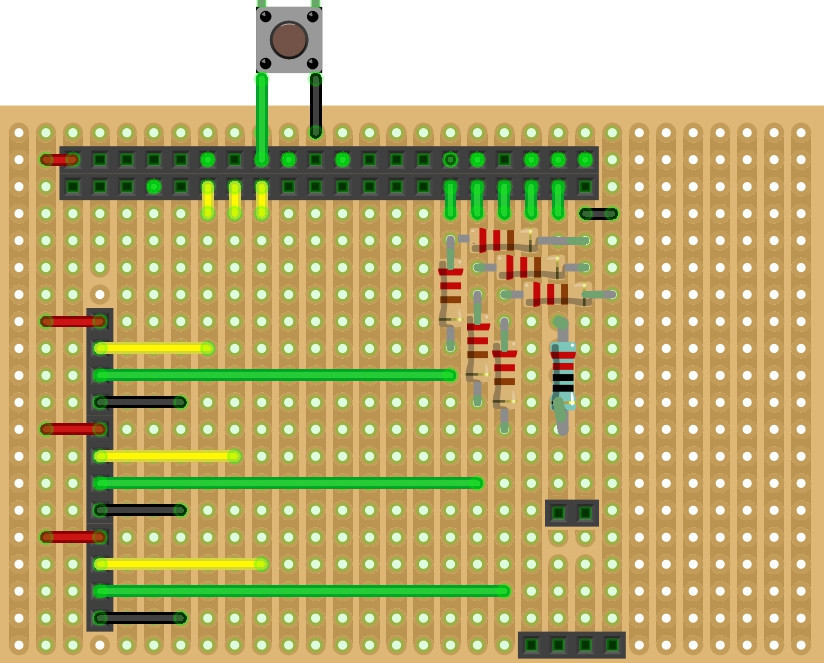
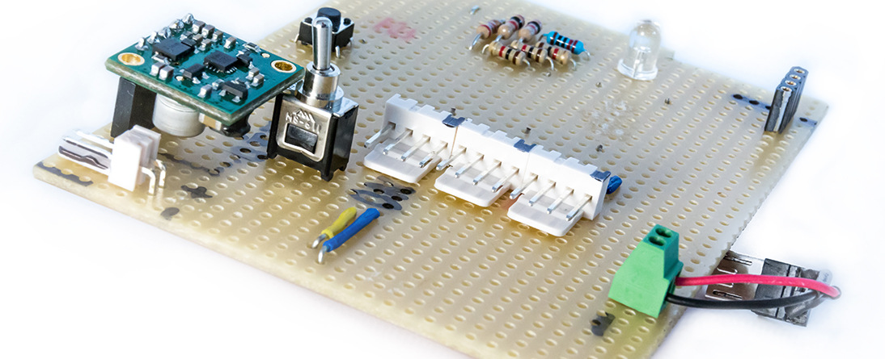
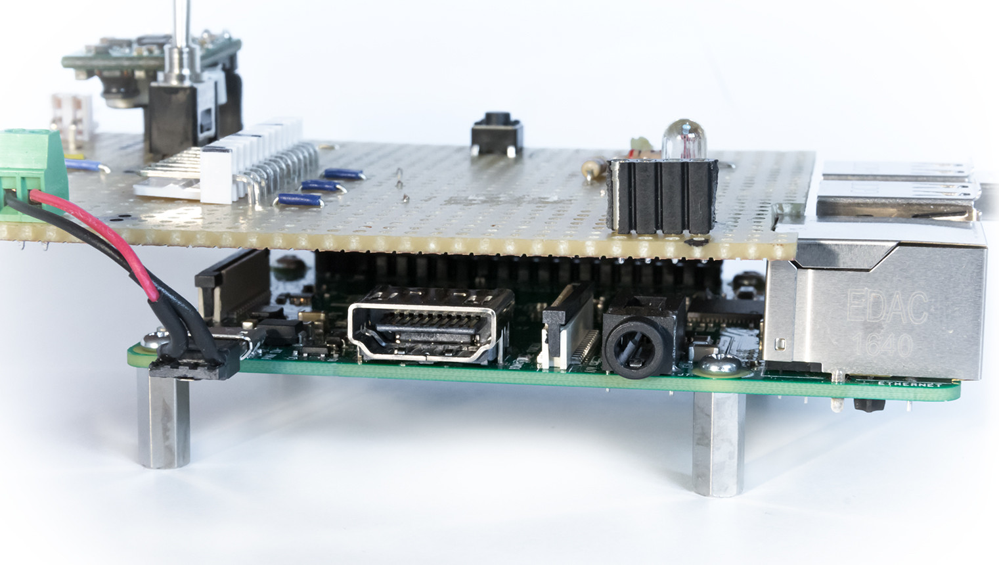

# Creating a mainboard for the drone

Besides the acoustic sensors, we need some other components connected to our PI. We created a small mainboard for that.

## Required components

Obviously, the most important components to be mounted on our Raspberry PI are the acoustic distance sensors. For the beginning,
three of them should be enough. But we want them to be replaceable, so we need some kind of plugs or connectors for them.

We also want the drone to communicate directly with its surroundings, for example to warn people standing nearby the 
drone if something went wrong, or for testing purposes, for example to indicate that the drone recognized an obstacle. Thats 
why we add an acoustic buzzer to the drone. This buzzer will be improved by an additional diode showing some more specific 
state information.

As the power supply will directly come from the drone, we also added a switch to enable and disable the current flow. (Please note: This happens on another free area on our board and is thus not contained in the plan below).

Finally, we want to start the drone not only by SSH but also by a simple physical action, so we added a simple button to the top.

## Planning the mainboard
We are short on experience with electrical engineering, so we decided to build the mainboard on a simple perfboard or stripboard. We used [Fritzing](http://fritzing.org) to plan the board, and that is what came out:

With this layout we can add all the required components and there is still some space left for future components.
Please note that there of course are interruptions required between the two main connector lines, and between the three connectors on the left side, which are not visible here! Otherwise this could lead to an electrical short and kill the PI.

## Building the mainboard
After destroying one of our PIs by a short circuit due to a missed interruption in the board, we first want to warn you: 
If you want to build a board yourself, please be careful and perform some intensive testing, e.g. with a multimeter to avoid such effects!

We started to prepare the stripboard with a box cutter. We had to be very tender, because the strips can easily break by accident. That worked well, and after testing that all parts were completely disconnected, we continued with removing the bigger parts with a small driller. We then added the resistors, jacks and all the other components and performed an extensive test of the board. After that, the board was ready to use:

We soldered the 40-pin jack (the one which will be connected with the PI) head first to have the plain layer (without copper) on top, so the mounted parts became visible and easy to reach. After mounting the board on our PI, it looks like this:

## Next steps

Our Bebop 2 is a small drone which does not have much space left for the raspberry PI and the mainboard. Therefore we will use a 3D printer to build something like a saddle for the drone which then will carry the whole stuff.

