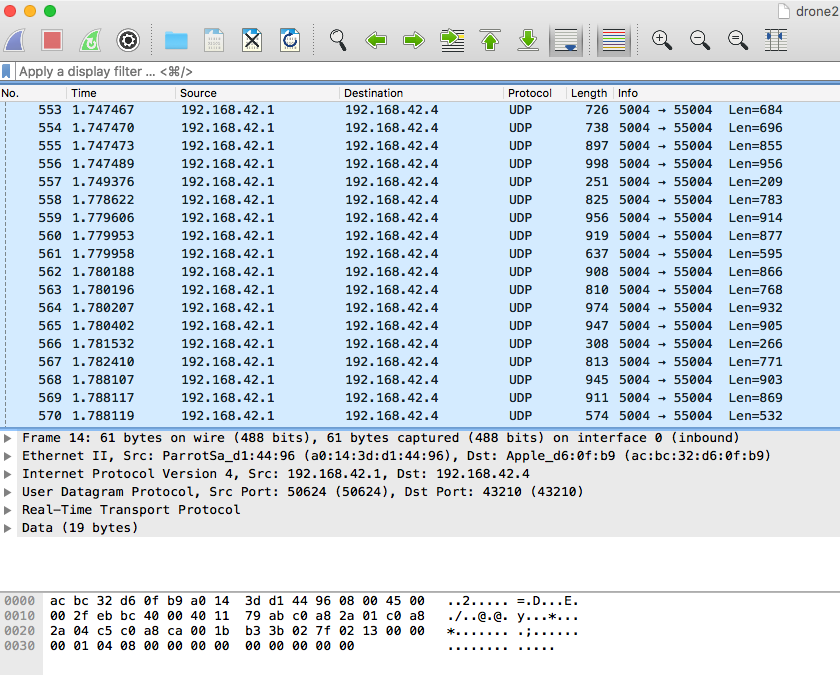

# Howto RTP stream bebop 2 drone video with python and opencv

The NodeJS support for opencv is not as good as in python. So we want to get the video 
stream with python 3.5 and opencv 3.2. There is not too much documentation to find on 
the net how the bebop drones video signal can be processed with external tools except VLC. 

So first of all you must be in the same WLAN as the drone. Usually something like 
Bepop2-08154711.

Second you need to start the video stream on the drone. For this we are using the 
node-bebop NodeJS library to connect and to send commands. We call this function 
from within python via PyExecJS ... So install with pip: 

```python
pip install PyExecJS
```

Like this we can call javascript from python. Here is a little hello-world:

```python
import execjs

ctx = execjs.compile("""
     function say(word) {
         return word;
     }
""")

print(ctx.call("say", "hello world"))
>>> hello world
```

Then we have this snippet to connect to the drone and enable video streaming. You have 
to have node-bebop installed (see https://github.com/hybridgroup/node-bebop):
 
```python
import execjs

ctx = execjs.compile('''
var bebop = require("/home/user/opencv/node-bebop/lib");
var drone = bebop.createClient();

function conn(){
  return drone.connect(function() {
    drone.MediaStreaming.videoStreamMode(2);
    drone.PictureSettings.videoStabilizationMode(3);
    drone.MediaStreaming.videoEnable(1);
  });
}
''')

print(ctx.call('conn'))
```
 
After sending this command the drone with hardcoded IP 192.168.42.1 will start pushing an RTP 
stream to the client on port 55004. To make sure that this works run a tcpdump and double 
check that the drone is actually sending data to that UDP port:

``` 
sudo tcpdump -s0 -w /tmp/drone.cap
```

Examine with wireshark:

Reference-style: 


Once the drone is sending data to your client you need an SDP file. The bebop does not 
implement RTSP so we need to provide meta-information for the stream with that file.

bebop.sdp:

```
c=IN IP4 192.168.42.1
m=video 55004 RTP/AVP 96
a=rtpmap:96 H264/90000
```
 
Finally you can start processing the video stream with opencv:

```python
import cv2

cam = cv2.VideoCapture("./bebop.sdp")

while True:
    ret, frame = cam.read()
    cv2.imshow("frame", frame)
    cv2.waitKey(1)
```

